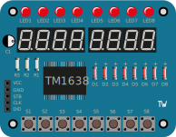
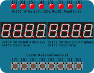

# RISC-V Venus Simulator embedded in VS Code

This Visual Studio Code extension embeds the popular
[Venus RISC-V simulator](https://venus.cs61c.org/). It provides a standalone
learning environment as no other tools are needed. It runs RISC-V assembly code
with the standard debugging capabilities of VS Code.

To use it as educational tool, further views are added as described below.

## Improvements

This extension is modified from `hm.riscv-venus` and added some feature for our course `CS110` in ShanghaiTech.

- **Dump to Hex**: added `dumpHex` options while debugging, which allows you to have a dump of translated assembly code.
- **Calling Convention Check**: goto settings page and enable CC Check, then the console will output CC Violation Warnings.
- **Step Back & Reverse Continue**: allows you to step backward and reverse continue until the last breakpoint.
- **Modifiable Memory Tab**: allows you to change memory content while running.
- **FIX: Problem running `.s` file on Windows**: fixed wrong recognition of drive/folder, now it can works on Windows.

## Installation

You can easily install the extension via the marketplace by searching for
"riscv":


Alternatively, you can install it via VS Code Quick Open (`CTRL+P`):

    ext install ZAMBAR.riscv-venus-cs110

## Getting Started

You can debug any assembler file you are editing. We recommend using the [RISC-V
Support](https://marketplace.visualstudio.com/items?itemName=zhwu95.riscv)
extension for syntax highlighting.

Just start debugging with "Run and Debug" to debug the current file:


You can step through the code and pseudo-operations are expanded automatically.
The actually executed instructions are displayed in an assembly view (auto-opens if set in extension-settings).
Breakpoints are of course also supported.

The basic [Venus environmental
calls](https://github.com/ThaumicMekanism/venus/wiki/Environmental-Calls) are
also supported. Further environment calls are also supported for educational toy
examples are described in the following.

## UI and launch paramters
From, the Debugger you can open the "Venus Options". From there you can open settings, views, documentation and more. Also there are commands for all these actions which you can execute with `CTRL+P` and typing "Venus: ..."


There is also Support for the VSCode-Inherent [launch.json](https://go.microsoft.com/fwlink/?linkid=830387). There are pre-made configs available which you can access by typing "Venus...". Alternatively a full launch.json currently looks like this.
```
{
    // Use IntelliSense to learn about possible attributes.
    // Hover to view descriptions of existing attributes.
    // For more information, visit: https://go.microsoft.com/fwlink/?linkid=830387
    "version": "0.2.0",
    "configurations": [
        {
            "type": "venus",
            "request": "launch",
            "name": "Launch current file with all options",
            "program": "${file}",
            "stopOnEntry": true,
            "stopAtBreakpoints": true,
            "dumpHex": false,
            "openViews": [
                "Robot",
                "LED Matrix",
                "Seven Segment Board", 
                "Led and Key Board"
            ],
            "ledMatrixSize": {
                "x": 10,
                "y": 10
            }
        }
    ]
}
```


### View memory

You can view the memory contents by opening the memory view with `CTRL+P` and
"Venus: Open Memory".


You can select which segment to view and scroll through the memory words (as in
the online Venus version).

Now you can also click the memory you want to modify and enter anything you want!

### Accessing registers

You can change the registers by clicking on their value, update the value and
press enter.


To change to format of the registers, click on "Venus Options" or press `CTRL+P`
and enter "Venus: Set Variable Format".


Also, you can use "Watch" tab and enter your register to watch.

## LED Matrix

The LED matrix is by default a 10x10 RGB LED matrix which size can be changed with launch parameters. Each LED is set individually by the
environment call `0x100`.


### Ecall `0x100`: Set Pixel

This sets the pixel at position `(x,y)` to an RGB color `(r,g,b)`:

- `a1` contains `x` in bits 31-16 and `y` in bits 15-0`
- `a2` contains `r` in bits 23-16, `g` in bits 15-8 and `b` in bits 7-0

For example to set a red pixel at position (2,4):

    li a0, 0x100
    li a1, 0x00020004
    li a2, 0x00FF0000
    ecall

### Ecall `0x101`: Set All Pixels

This sets all pixels to an RGB color `(r,g,b)`:

- `a1` contains `r` in bits 23-16, `g` in bits 15-8 and `b` in bits 7-0

For example to set all pixels to red:

    li a0, 0x101
    li a1, 0x00FF0000
    ecall

### Using the LED matrix view

You can open the board view by pressing `CTRL+P` and then select/enter "Venus:
Open LED Matrix".

Alternatively, you can have it open automatically by adding
[`.vscode/launch.json`](https://github.com/hm-riscv/vscode-riscv-venus/blob/master/examples/ledmatrix/.vscode/launch.json) in your project:

    {
        "version": "0.2.0",
        "configurations": [
            {
                "type": "venus",
                "request": "launch",
                "name": "Debug current file",
                "program": "${file}",
                "stopOnEntry": true,
                "openViews": [ "LED Matrix" ]
            }
        ]
    }

You find an example that draws the RISC-V logo
[here](https://github.com/hm-riscv/vscode-riscv-venus/tree/master/examples/ledmatrix).

## Toy Robot LED Matrix

The toy robot example is a variation of the LED matrix, but with a different
style and way of setting the LEDs: The LEDs are all green and are set by a
single bitmask per row. It has 12 rows of each 16 LEDs.


### Ecall `0x110`: Set LED row

Update a single row:

- `a1` sets the row, where 0 is the bottom row
- `a2` contains the LEDs on/off (1/0) status in bits 15-0 where bit 15 is the
   leftmost LED

### Using the LED matrix view

You can open the board view by pressing `CTRL+P` and then select/enter "Venus:
Open LED Matrix".

Alternatively, you can have it open automatically by adding
[`.vscode/launch.json`](https://github.com/hm-riscv/vscode-riscv-venus/blob/master/examples/robot/.vscode/launch.json) in your project:

    {
        "version": "0.2.0",
        "configurations": [
            {
                "type": "venus",
                "request": "launch",
                "name": "Debug current file",
                "program": "${file}",
                "stopOnEntry": true,
                "openViews": [ "Robot" ]
            }
        ]
    }

You find an example that draws the RISC-V logo
[here](https://github.com/hm-riscv/vscode-riscv-venus/tree/master/examples/robot).

## Seven Segment Board

The seven segment is a more complex example. It has two push buttons as input
devices and two LEDs and seven segment displays as output.


### Ecall `0x120`: Set seven segment display

This ecall updates the seven segment display. The segments can be driven
individually. The environment call expects the values and a mask of valid
updates in two registers.

The segments are mapped to the bits in the two registers (value and mask) as
follows:


Register `a1` contains the values and register `a2` contains the mask of the
updates.

The following code will show "42" in the segments:

    li a0, 0x120
    li a1, 0b0110011001011011
    li a2, 0b1111111111111111
    ecall

Update only two segments:

    li a0, 0x120
    li a1, 0b0000000000000100
    li a2, 0b0000000000010100
    ecall

What will the segments display now?

### Ecall `0x121`: Set LEDs

This environment call sets the LEDs as defined in the two lowest bits of `a1`.
Bit 0 sets LED 0 (green) and bit 1 sets LED 1 (red). The LEDs are on when the
bit is 1 and off when the bit is 0. The LEDs preserve their state until they are
changed by calling this ecall again.

The following code lets the LEDs blink alternating:

    loop:
    li a0, 0x121
    li a1, 0b01
    ecall
    li a0, 0x121
    li a1, 0b10
    ecall
    j loop

### Ecall `0x122`: Read push buttons

This reads whether the push buttons have been pressed. Once the push buttons are
pressed they will visually be highlighted as the environment will buffer this
press. The ecall whether the two buttons were pressed in the lowest two bits of
`a0` and resets the buffers.

The following code reads whether buttons have been pressed and set the LEDs
accordingly.

    loop:
    li a0, 0x122
    ecall
    mv a1, a0
    li a0, 0x121
    ecall
    j loop

### Using the board view

You can open the board view by pressing `CTRL+P` and then select/enter "Venus:
Open Seven Segment Board UI".

Alternatively, you can have it open automatically by adding
[`.vscode/launch.json`](https://github.com/hm-riscv/vscode-riscv-venus/blob/master/examples/sevensegboard/.vscode/launch.json) in your project:

    {
        "version": "0.2.0",
        "configurations": [
            {
                "type": "venus",
                "request": "launch",
                "name": "Debug current file",
                "program": "${file}",
                "stopOnEntry": true,
                "openViews": [ "Seven Segment Board" ]
            }
        ]
    }

You can find an example [here](https://github.com/hm-riscv/vscode-riscv-venus/blob/master/examples/sevensegboard/).


### Terminal: Ecall `0x130` and `0x131`
There is a Terminal which supports the standard Venus Ecalls for printing integers and strings and error output. In addition also Input is supported (currently only via polling until Interrupts are supported).

To activate Input the Ecall 0x130 must be called. After that you can ecall 0x131 to read the input. After sending your input with enter in the console, internally the input is buffered and can be read one by one with calling 0x131. There are 3 states when calling 0x131(read Input):
- a0 == 0x00000001: Still waiting for input.
- a0 == 0x00000000: All Input has been read. Buffer is empty.
- a0 == 0x00000002: Input has been detected and one character has been read. a1 == input in UTF-16 code.

For an example see terminal.s in examples in the repository.


### Example assignment

Implement a counter with the seven segment board. Count up when button 1 is
pressed and count down when button 0 is pressed. Display the current counter
value in the seven segment display. Let the red LED blink when the counter
overflows.

## LED and Key Board

The LED & Key board is a common I/O module.  It includes 8 buttons, 8 LEDs, and 8 7-segment displays.  



Ecalls use bits in argument values for each element of the board.  Bit positions, with 0 being the least significant bit (rightmost bit in place-value notation) are:



### Ecall `0x150`: Set LEDs 

This ecall updates the LEDs on the top of the board. The least significant 8-bits of `a1` are used for the on/off values of LEDs.  Bit 0 represents the right-most LED, etc.  **Note that the bit order is both 0-based and right-to-left.  The LED names on the board are given in a 1-based, left-to-right order.**

### Ecall `0x151`: Get LEDs 

This ecall retrieves the current value of LED states in `a0`.

### Ecall `0x152`: Set right four seven segment displays  

This ecall updates the rightmost four seven segment displays.  The values of `a1` are used to designate which of the 32 individual LEDs should be activated as previously shown.

### Ecall `0x153`: Get right four seven segment displays  

This ecall retrieves the current value of individual segments for the rightmost four displays in `a0`.

### Ecall `0x154`: Set left four seven segment displays  

This ecall updates the leftmost four seven segment displays.  The values of `a1` are used to designate which of the 32 individual LEDs should be activated as previously shown.

### Ecall `0x155`: Get right four seven segment displays

This ecall retrieves the current value of individual segments for the leftmost four displays in `a0`.

### Ecall `0x156`: Get Buttons

This ecall retrieves the current value of buttons in `a0`. A `1` indicates the button is currently pressed.

### Using the board view

You can open the board view by pressing `Command+P` (macOS) or `CTRL+P` (Windows) and then select/enter "Venus: Open Led and Key Board UI".

Alternatively, you can have it open automatically by adding
[`.vscode/launch.json`](https://github.com/hm-riscv/vscode-riscv-venus/blob/master/examples/sevensegboard/.vscode/launch.json) in your project:

    {
        "version": "0.2.0",
        "configurations": [
            {
                "type": "venus",
                "request": "launch",
                "name": "Debug current file",
                "program": "${file}",
                "stopOnEntry": true,
                "openViews": [ "Led and Key Board" ]
            }
        ]
    }

You can find an example [here](https://github.com/digital-logic-and-computer-design/vscode-riscv-venus-2/blob/feat-ext-led-and-key/examples/ledandkeyboard/ledandkeyboard.s).

### Credits

The LED & Key artwork (.svg) was the work of [Thomas_W59](https://forum.fritzing.org/t/tm1638-led-and-key/1916) from Thomas' Fritzing package.

The extension is an adaption of [prior work](https://github.com/hm-riscv/vscode-riscv-venus/commit/ed25b9f1a09f2c33770f9a0aa6eb6bc7949a616f) by [Stefan Wallentowitz](https://github.com/wallento).